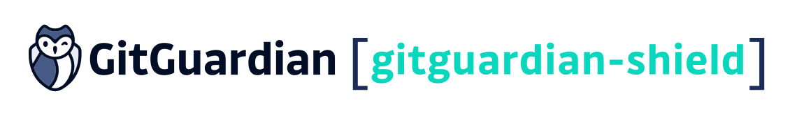

---

# GitGuardian Shield: protect your secrets with GitGuardian

The GitGuardian shield (ggshield) is a CLI application that runs in your local environment
or in a CI environment to help you detect policy breaks.

ggshield uses our [public API](https://api.gitguardian.com/doc) to scan your files and detect potential secrets or issues in your code.

You can also use ggshield via the [pre-commit](https://pre-commit.com/) framework on your repositories, or as a standalone pre-commit either globally or locally.

## Table of Contents

1. [Introduction](#introduction)
2. [Installation](#installation)
3. [Commands](#commands)

   - Scan
   - Install

4. [Pre-commit](#pre-commit)

   - The pre-commit framework
   - The global and local pre-commit hook

5. [GitLab](#gitlab)
6. [Output](#output)
7. [Contributing](#contributing)
8. [License](#license)

# Installation

Install and update using `pip`:

```shell
$ pip install ggshield
```

ggshield supports **Python 3.6 and newer**.

The package should run on MacOS, Linux and Windows.

# Commands

```shell
Usage: ggshield [OPTIONS] COMMAND [ARGS]...

Options:
  -h, --help    Show this message and exit.

Commands:
  install  Command to install a pre-commit hook (local or global).
  scan     Command to scan various content.
```

## Scan command

**ggshield** allows you to scan your files in 3 different ways:

- `Pre-commit`: scan every changes that have been staged in a git repository
- `CI`: scan every commit since the last build in your CI (currently supports GitLab CI, Travis CI and CircleCI)
- `Files`: scan files or directories with the recursive option

```shell
Usage: ggshield scan [OPTIONS] [PATHS]...

  Command to scan various content.

Options:
  -m, --mode [pre-commit|ci]  Scan mode (pre-commit or ci)
  -r, --recursive             Scan directory recursively
  -y, --yes                   Confirm recursive scan
  -v, --verbose               Display the list of all files (recursive scan)
  -h, --help                  Show this message and exit.
```

## Install command

The `install` command allows you to use ggshield as a pre-commit hook on your machine, either locally or globally for all repositories.

You will find further details in the pre-commit part of this documentation.

```shell
Usage: ggshield install [OPTIONS]

  Command to install a pre-commit hook (local or global).

Options:
  -m, --mode [local|global]  Hook installation mode  [required]
  -f, --force                Force override
  -h, --help                 Show this message and exit.
```

# Pre-commit

## The pre-commit framework

In order to use **ggshield** with the [pre-commit](https://pre-commit.com/) framework, you need to do the following steps.

Make sure you have pre-commit installed:

```shell
$ pip install pre-commit
```

Create a `.pre-commit-config.yaml` file in your root repository:

```yaml
repos:
  - repo: https://github.com/gitguardian/gg-shield
    rev: dev
    hooks:
      - id: ggshield
        language_version: python3
        stages: [commit]
```

Then install the hook with the command:

```shell
$ pre-commit install
pre-commit installed at .git/hooks/pre-commit
```

Now you're good to go!

If you want to skip the pre-commit check, you can add `-n` parameter:

```shell
$ git commit -m "commit message" -n
```

Another way is to add SKIP=hook_id before the command:

```shell
$ SKIP=ggshield git commit -m "commit message"
```

## The global and local pre-commit hook

To install pre-commit globally (for all current and future repo), you just need to execute the following command:

```shell
$ ggshield install --mode global
```

It will do the following:

- check if a global hook folder is defined in the global git configuration
- create the `~/.git/hooks` folder (if needed)
- create a `pre-commit` file which will be executed before every commit
- give executable access to this file

You can also install the hook locally on desired repositories.
You just need to go in the repository and execute:

```shell
$ ggshield install --mode local
```

If a pre-commit executable file already exists, it will not be overriden.

You can force override with the `--force` option:

```shell
$ ggshield install --mode local --force
```

If you already have a pre-commit executable file and you want to use gg-shield,
all you need to do is to add this line in the file:

```shell
ggshield scan --mode pre-commit
```

# GitLab

> You may be interested in using GitGuardian's [GitLab integration](https://dashboard.gitguardian.com/settings/workspace/integrations/gitlab) to ensure full coverage of your GitLab projects.

Configuring GitLab pipelines to use **ggshield** is as simple as
adding a step to your project's pipeline:

```yaml
stages:
  - scanning

🦉 gitguardian scan:
  image: gitguardian/ggshield:latest
  stage: scanning
  script: ggshield scan -m ci
```

# Output

If no policy breaks have been found, you will have a simple message:

```bash
$ ggshield scan -m pre-commit
No policy breaks have been found
```

If a policy break lies in your staged code or in your CI,
you will have an alert giving you the type of policy break,
the filename where the policy break has been found and a patch
giving you the position of the policy break in the file:

```shell
$ ggshield scan -m pre-commit

🛡️  ⚔️  🛡️  2 policy breaks have been found in file production.rb

11 | config.paperclip_defaults = {
12 |     :s3_credentials => {
13 |     :bucket => "XXX",
14 |     :access_key_id => "XXXXXXXXXXXXXXXXXXXX",
                            |_____AWS Keys_____|

15 |     :secret_access_key => "XXXXXXXXXXXXXXXXXXXXXXXXXXXXXXXXXXXXXXXX"
                                |_______________AWS Keys_______________|

16 |     }
17 | }
```

# Contributing

If you have questions you would like to ask the developers,
or feedback you would like to provide,
feel free to create an issue on our issue tracker

We would love to hear from you.
Additionally, if you have a feature you would like to suggest,
feel free to create an issue on our issue tracker

# License

**GitGuardian-shield** is MIT licensed.
